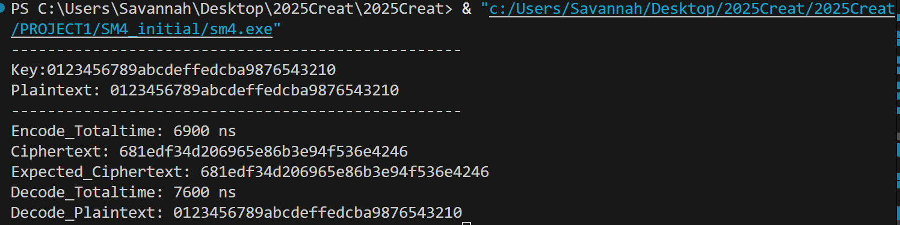
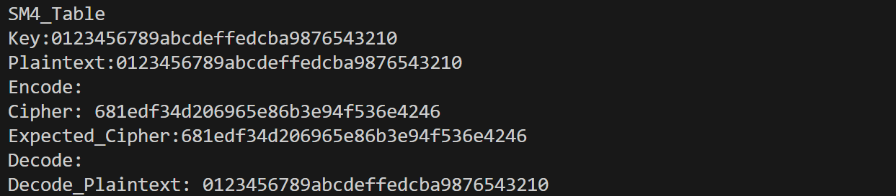
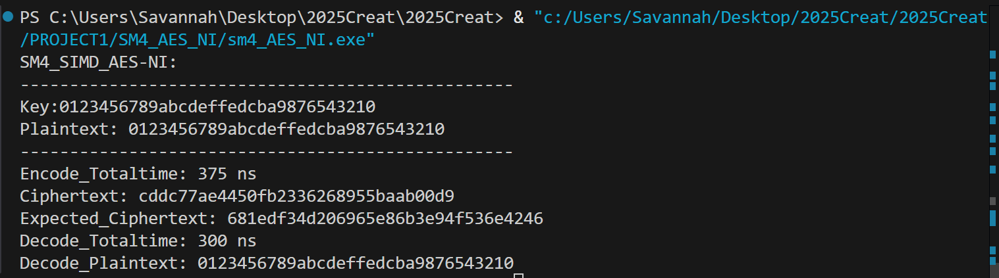
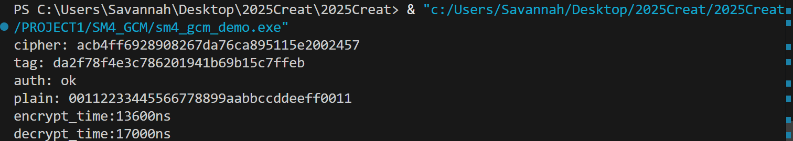

# PROJECT1 实验报告：SM4 软件实现与优化、SM4-GCM 优化实现

##实验目标
- 基于 SM4 的标准实现，完成多种软件优化：
  - 基础实现
  - T-table 查表优化
  - 利用指令集（AES-NI 同构映射
  - 最新指令集GFNI、VPROLD等
- 在此基础上实现并优化 SM4-GCM 工作模式

对应目录：
- `SM4_initial/sm4.cpp`：标量参考实现与自测
- `SM4_table/sm4_Table.cpp`：查表优化实现
- `SM4_AES_NI/sm4_AES_NI.cpp`：利用 AES-NI/SSSE3 的同构映射优化（含多块并行）
- `SM4_GCM/`：SM4-GCM实现

## 实验原理
### SM4 分组密码简述
- 分组大小 128 比特，密钥 128 比特，32 轮迭代。
- 每轮包含：T 变换（S 盒字节替换 + 线性变换 L）与轮密钥加。
- 关键变换：
  - S 盒为 8 位输入输出的固定置换。
  - 线性变换 L：对 S 盒输出做多次循环左移并异或（2/10/18/24 位）。
  - 密钥扩展：使用 T' 变换（13/23 位移）和系统参数 FK/CK 产生 32 个轮密钥。

### 软件优化思路
- T-table：将 S 盒与线性变换融合到 4 张 256×32 位表中，减少每轮的字节级操作与移位异或，降低指令数量与分支。
- 指令集优化：
  - AES-NI 同构映射：将 SM4 S 盒映射到 AES 域，使用 `_mm_aesenclast_si128` 完成 S 盒，再映回 SM4 域；配合 `_mm_shuffle_epi8`（SSSE3）实现字节洗牌；使用寄存器并行与循环展开。
  - GFNI/VPROLD：
    - GFNI 可用于更快捷地描述 GF(2) 上的线性/仿射变换，理论上可进一步简化同构映射步骤。
  - SIMD 多块并行：同时处理 4×128bit 块，提升吞吐。

### GCM 工作模式原理
- GCM = CTR 流水加密 + GHASH 认证。
- CTR：对 `J0+1, J0+2, ...` 做分组加密得到密钥流，与明文异或产生密文；计数器采用 32 位大端自增（inc32）。
- GHASH：在 GF(2^128) 上对 AAD 与密文进行多项式累乘求和：
  - 子密钥 `H = E_K(0^128)`。
  - 认证值 `S = GHASH_H(AAD || C || len(AAD)||len(C))`。
  - 标签 `Tag = E_K(J0) XOR S`。
- IV 处理：
  - 若 IV 长度为 12 字节，`J0 = IV || 0x00000001`；
  - 否则 `J0 = GHASH_H(IV || pad || 64-bit(0) || 64-bit(len(IV)bits))`。

## 实现说明
### 参考实现（`SM4_initial/sm4.cpp`）
- 按标准实现 S 盒、FK/CK、T/T' 变换、轮密钥生成与 32 轮加解密。
- 使用国家标准测试向量验证：
  - Key/Plain: `0123456789abcdeffedcba9876543210`
  - Cipher: `681edf34d206965e86b3e94f536e4246`

### T-table 实现（`SM4_table/sm4_Table.cpp`）
- 预计算 T 表，将 S 盒与 L 变换融合到表项，轮函数主要变为若干表查与异或，显著减少指令与缓存缺失影响。

### AES-NI实现（`SM4_AES_NI/sm4_AES_NI.cpp`）
- 通过同构映射把 SM4 S 盒转到 AES 域，调用 `_mm_aesenclast_si128`，再映回；
- 使用 `_mm_shuffle_epi8` 做字节打散/重排；
- 4 块并行+循环展开，减少轮间开销；
- 计时用 `std::chrono`，展示单位开销；
- 该路径在支持 AES-NI 的 x86 平台有明显吞吐优势。

### SM4-GCM（`SM4_GCM/`）
- 关键细节：
  - 复用标量 SM4 加密单块作为 CTR 与生成 H；
  - GHASH 使用二进制多项式乘法（不可约多项式 `x^128 + x^7 + x^2 + x + 1`），当前实现为位串算法；
  - 计数器 `inc32` 以大端自增末 32 位；
  - Tag 常数时间比较，认证失败不输出明文。

## 实验结果
### SM4运行结果

### SM4查表运行结果

### SM4_AES_NI运行结果

可观察到AES_NI优化后相比原始SM4速度有极大提升
### SM4_GCM运行结果

