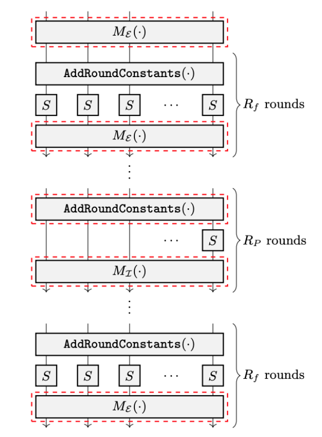
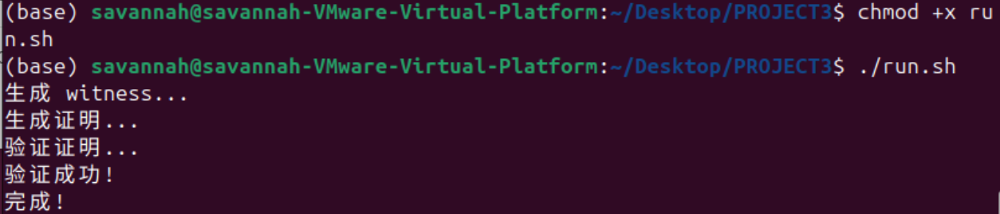

# Poseidon2 哈希算法零知识证明电路实现

## 实验概述

本实验使用 circom 语言实现了 Poseidon2 哈希算法的零知识证明电路，并基于 Groth16 协议生成和验证零知识证明。该实现允许证明者在不泄露原像的情况下，证明自己知道某个 Poseidon2 哈希值对应的原像。

## 实验原理

### 1. Poseidon2 哈希算法

Poseidon2 是专为零知识证明系统设计的哈希函数，具有以下特点：

- **参数配置**：使用参数 (n,t,d)=(256,3,5)
  - n=256：有限域大小为 2^256
  - t=3：状态宽度为 3 个field元素
  - d=5：S-box 次数为 5（x^5）

- **轮函数结构**：
  - 全轮数 R_F = 8 (前4轮 + 后4轮)
  - 部分轮数 R_P = 56 (本实现简化为8轮)

- **算法步骤**：
  1. **AddRoundConstants**：添加轮常量
  2. **SubWords (S-box)**：应用 x^5 置换
  3. **MixLayer**：MDS 矩阵混淆

### 2. 零知识证明原理

**目标**：证明知道满足 `hash = Poseidon2(preimage)` 的原像 `preimage`，而不泄露 `preimage` 的具体值。

**Groth16 协议**：
- **Setup阶段**：生成公共参考字符串(CRS)，包括证明密钥和验证密钥
- **Prove阶段**：证明者使用私密输入生成零知识证明
- **Verify阶段**：验证者使用公开输入和证明进行验证


## 实现过程


### Pseidon2电路实现


```circom
template Poseidon2FullRound(round) {
    signal input state[3];
    signal output out[3];
    
    // MDS矩阵
    var M[3][3] = [
        [2, 1, 1],
        [1, 2, 1], 
        [1, 1, 2]
    ];
    
    // 轮常量
    var C[3] = [round + 1, round + 2, round + 3];
    
    // 1. AddRoundConstants
    signal tmp[3];
    for (var i = 0; i < 3; i++) {
        tmp[i] <== state[i] + C[i];
    }
    
    // 2. S-box (x^5)
    component pow5[3];
    signal sbox[3];
    for (var i = 0; i < 3; i++) {
        pow5[i] = Pow5();
        pow5[i].in <== tmp[i];
        sbox[i] <== pow5[i].out;
    }
    
    // 3. MDS矩阵混淆
    for (var i = 0; i < 3; i++) {
        var sum = 0;
        for (var j = 0; j < 3; j++) {
            sum += M[i][j] * sbox[j];
        }
        out[i] <== sum;
    }
}
```

### 编译和设置流程

**compile.sh** - 完整的编译和密钥生成脚本：
```bash
# 1. 编译电路
circom poseidon2.circom --r1cs --wasm --sym

# 2. Trusted Setup - Powers of Tau
snarkjs powersoftau new bn128 12 pot12_0000.ptau
snarkjs powersoftau contribute pot12_0000.ptau pot12_0001.ptau
snarkjs powersoftau prepare phase2 pot12_0001.ptau pot12_final.ptau

# 3. 生成证明密钥和验证密钥
snarkjs groth16 setup poseidon2.r1cs pot12_final.ptau poseidon2_0000.zkey
snarkjs zkey contribute poseidon2_0000.zkey poseidon2_final.zkey
snarkjs zkey export verificationkey poseidon2_final.zkey verification_key.json
```

### 测试流程

**test.sh** - 电路编译和基础测试脚本：
```bash
# 1. 检查文件完整性
if [ ! -f "poseidon2.circom" ]; then
    echo "错误: poseidon2.circom 文件不存在"
    exit 1
fi

# 2. 编译电路并生成witness
circom poseidon2.circom --r1cs --wasm --sym
node poseidon2_js/generate_witness.js poseidon2_js/poseidon2.wasm input.json witness.wtns

# 3. 显示电路信息和约束
snarkjs r1cs info poseidon2.r1cs
snarkjs r1cs print poseidon2.r1cs poseidon2.sym
```

### 证明生成和验证流程

**run.sh** - 完整的证明生成和验证脚本：
```bash
# 1. 生成witness（见证）
echo "生成 witness..."
node poseidon2_js/generate_witness.js poseidon2_js/poseidon2.wasm input.json witness.wtns

# 2. 生成零知识证明
echo "生成证明..."
snarkjs groth16 prove poseidon2_final.zkey witness.wtns proof.json public.json

# 3. 验证证明
echo "验证证明..."
snarkjs groth16 verify verification_key.json public.json proof.json
```

**verify.js** - Node.js证明验证脚本：
```javascript
const snarkjs = require("snarkjs");
const fs = require("fs");

async function main() {
    // 读取输入数据
    const input = JSON.parse(fs.readFileSync("input.json"));
    
    // 生成证明
    const { proof, publicSignals } = await snarkjs.groth16.prove(
        "poseidon2_final.zkey", 
        "witness.wtns"
    );
    
    // 验证证明
    const vKey = JSON.parse(fs.readFileSync("verification_key.json"));
    const res = await snarkjs.groth16.verify(vKey, publicSignals, proof);
    
    // 输出验证结果
    if (res === true) {
        console.log("验证成功!");
    } else {
        console.log("验证失败!");
    }
}
```


## 实验结果

### 实验数据

**测试用例**：
- 原像：`preimage = [1, 2]`
- 哈希值：`11776086303972766858850986939467530957546092753519669849654773354764785408076`

### 运行结果截图



