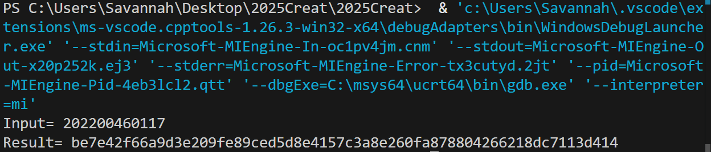
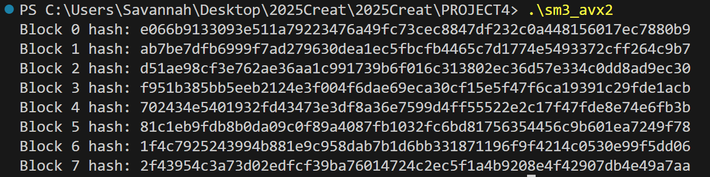
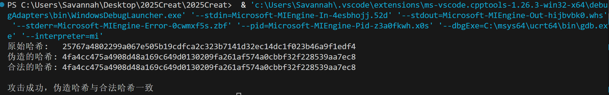
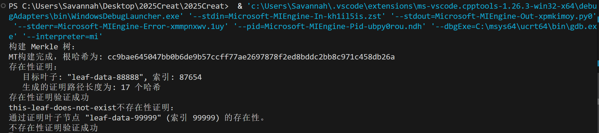

# PROJECT4
## 实验要求
- a）与Project 1类似，从SM3的基本软件实现出发，参考付勇老师的PPT，不断对SM3的软件执行效率进行改进。
- b）基于SM3的实现，验证 length-extension attack。
- c）基于SM3的实现，根据 RFC6962 构建 Merkle 树（10 万叶子节点），并生成叶子的存在性证明和不存在性证明。

## 实验过程
### 1. SM3 基本实现与性能优化

- 使用 `SM3.cpp` 实现 SM3 哈希算法的基础版本，验证功能正确性。
- 基于付勇老师 PPT，使用 SIMD/AVX2 技术在 `SM3_SIMD.cpp` 中实现优化

### 2. Length-extension Attack
- 原理说明：SM3 属于 Merkle–Damgård 构造，内部状态等同于哈希输出，处理分组大小为 512bit，每次压缩产生 256bit 输出。
  - 消息填充规则：先追加单字节 `0x80`，再追加若干 `0x00` 直至整个消息长度（包括64bit长度域）为512的整数倍，最后追加原始消息比特长度（64bit大端）。
  - 攻击者已知原始消息哈希 `H` 及消息长度 `L`，可根据标准填充重构填充块，并以 `H` 作为初始内部状态，直接压缩拓展数据，无需密钥或消息明文。
- 攻击流程：
  1. 使用 `sm3_hash` 计算带密钥消息 `key || msg` 的合法哈希 `H`。
  2. 调用 `sm3_hash_continue` 恢复 `H` 作为内部状态，构造原始填充并压缩扩展数据 `extension`，生成伪造哈希 `H'`。
  3. 服务器对完整消息 `key||msg||padding||extension` 调用 `sm3_hash` 计算合法哈希 `legitimate_hash`，比较 `H' == legitimate_hash`，若相等攻击成功。
- 代码验证：在 `SM3_attack.cpp` 中打印 `原始哈希`、`伪造哈希` 及 `合法哈希`，并输出攻击结果。

### 3. Merkle 树构建与证明
- 构建细节：
  - 叶子哈希：`leaf_hash = SM3(0x00 || data)`，前缀 `0x00` 区分叶子与内部节点。
  - 内部节点哈希：`node_hash = SM3(0x01 || left_hash || right_hash)`，前缀 `0x01` 并连接子节点哈希。
  - 若当前层节点数为奇数，复制最后一个节点哈希以保持偶数节点。
  - 树高约 `ceil(log2(N))`，100,000 叶子对应约 17 层，每层批量计算哈希加速构建。
- 存在性证明细节：
  - 证明路径包含叶子到根沿途每层的兄弟节点哈希及左右位置指示。
  - 验证时，从 `leaf_hash` 起，按顺序使用 `node_hash = SM3(0x01 || left || right)` 逐层计算，最终比较根哈希。
  - 典型路径长度约为 `树高`，证明大小约 `树高 * 32 bytes`。
- 不存在性证明细节：
  - 在有序叶子列表中查找目标位置 `i`，若值不匹配，则定位在两个相邻叶子之间。
  - 对相邻叶子生成存在性证明，证明该索引已被占据，间接说明目标数据不存在。
- 代码验证：在 `SM3_MT.cpp` 中打印根哈希、存在性与不存在性证明结果，并检查验证函数输出。

## 实验结果
### SM3运行结果

### SM3_SIMD运行结果

### Length-extension Attack运行结果

### Merkle Tree运行结果

