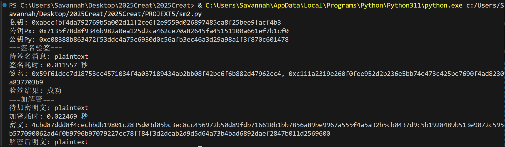
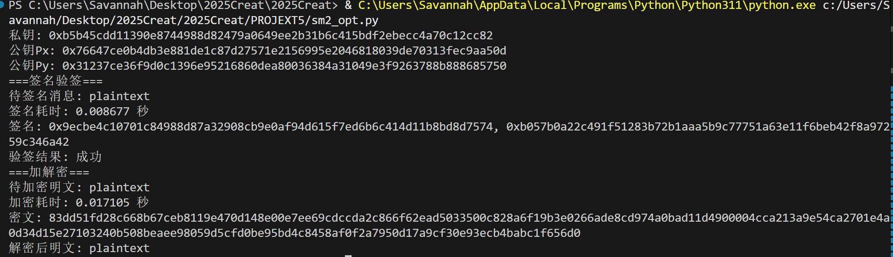
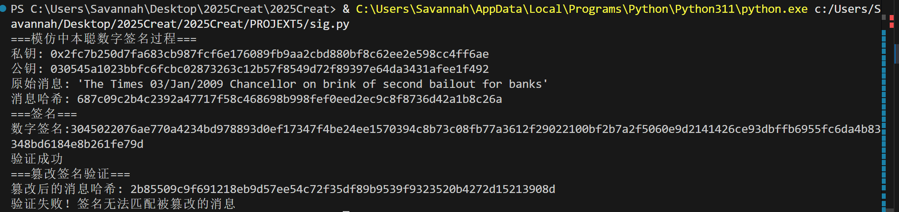

# SM2的软件实现和优化

## SM2实现

### 算法流程：
  1. **密钥生成**：随机选择私钥 `d ∈ [1,n-1]`，计算公钥 `P = d·G`。
  2. **签名**：
     - 计算消息摘要 `e = SM3(Z || M)`。
     - 生成随机数 `k`，计算 `(x1, y1) = k·G`，取 `r = (e + x1) mod n`。
     - 计算 `s = ((1 + d)^{-1} · (k - r·d)) mod n`，输出签名对 `(r, s)`。
  3. **验签**：
     - 计算摘要 `e`，计算 `t = (r + s) mod n`。
     - 计算 `(x2, y2) = s·G + t·P`，验证 `r ≡ (e + x2) mod n`。

### 优化实现
- 在 `sm2_opt.py` 中对椭圆曲线标量乘法进行改进：
  - 引入窗口化非相邻表示（w-NAF）算法，将标量 k 表示为稀疏的奇数系数序列，减少了双倍与相加运算次数。
  - 预计算基点 G 的奇数倍点列表（如 1·G、3·G、…、(2^w-1)·G），避免重复计算，加速多次点乘。
- 在 `SM2Key` 类中，签名、验签、加解密函数均调用优化后的 `scalar_mult` 而非原始的 `scalar_mult_double_and_add`。

### 运行结果
#### SM2基础实现

#### SM2优化实现

## 重用k的攻击

### 漏洞原理

SM2数字签名算法的安全性依赖于每次签名时所使用的随机数`k`（也称Nonce）的**唯一性**和**保密性**。如果签名者使用相同的私钥 `d` 和**相同的随机数 `k`** 对两条**不同的消息** `M₁` 和 `M₂` 进行了签名，攻击者仅凭这两条消息和对应的签名，就可以通过解联立方程的方式直接计算出签名者的私钥 `d`。

### SM2 签名核心公式

1.  **计算消息摘要**: 
    $e = \text{SM3}(Z \ || \ M)$

2.  **生成随机数**: 
    选择一个随机数 $k \in [1, n-1]$

3.  **计算椭圆曲线上的点**:
    $(x_1, y_1) = kG$
    其中 `G` 是曲线的基点。

4.  **计算签名分量 `r`**:
    $r = (e + x_1) \pmod{n}$

5.  **计算签名分量 `s`**:
    $s = ((1+d)^{-1} \cdot (k - r \cdot d)) \pmod{n}$
    其中 `d` 是签名者的私钥。

### 推导过程

假设攻击者获得了由同一个私钥 `d` 和同一个随机数 `k` 生成的两组签名：

* 对消息 `M₁` 的签名: $(r_1, s_1)$
* 对消息 `M₂` 的签名: $(r_2, s_2)$

攻击者已知 `M₁`, `M₂`, $(r_1, s_1)$, $(r_2, s_2)$，并且可以计算出对应的消息摘要 `e₁` 和 `e₂`。攻击目标是求解未知的私钥 `d`。

**根据签名公式：**
$$
s_1 = ((1+d)^{-1} \cdot (k - r_1 \cdot d)) \pmod{n}
$$

$$
s_2 = ((1+d)^{-1} \cdot (k - r_2 \cdot d)) \pmod{n}
$$

将 `s` 的方程进行变形，目的是将未知的 `k` 表达为由已知量和另一个未知数 `d` 构成的表达式。

从通用公式 `s = ((1+d)⁻¹ * (k - r*d)) mod n` 开始：

1.  等式两边同时乘以 `(1+d)`：
    $s \cdot (1+d) = (k - r \cdot d) \pmod{n}$
2.  展开左侧：
    $s + s \cdot d = k - r \cdot d \pmod{n}$
3.  将含有 `d` 的项移到一边，解出 `k`：
    $k = s + s \cdot d + r \cdot d \pmod{n}$
4.  合并含有 `d` 的项：
    $k = s + d(s + r) \pmod{n}$

* 从签名1得到：
  $$k = s_1 + d(s_1 + r_1) \pmod{n} \quad$$

* 从签名2得到：
  $$k = s_2 + d(s_2 + r_2) \pmod{n} \quad $$

由于两次签名使用了完全相同的 `k`：
$$
s_1 + d(s_1 + r_1) = s_2 + d(s_2 + r_2) \pmod{n}
$$
将所有含有 `d` 的项移到等式右边，常数项移到左边：
$$
s_1 - s_2 = d(s_2 + r_2) - d(s_1 + r_1) \pmod{n}
$$
提取公因子 `d`：
$$
s_1 - s_2 = d \cdot (s_2 + r_2 - s_1 - r_1) \pmod{n}
$$
解出 `d`：
$$
d = (s_1 - s_2) \cdot (s_2 + r_2 - s_1 - r_1)^{-1} \pmod{n}
$$
### 攻击结果

## 模拟实现中本聪数字签名
### 实验过程
  - `sig.py` 使用 secp256k1 曲线和双重 SHA-256 实现比特币风格的 ECDSA 签名。
  - `generate_satoshi_style_keypair` 生成私钥与压缩公钥；`sign_message` 对双 SHA-256 摘要进行 Prehashed 签名；`verify_signature` 验证签名有效性。
  - 篡改测试：对篡改消息重新哈希后调用 `verify_signature`，应返回失败，证明签名防篡改能力。

### 运行结果
