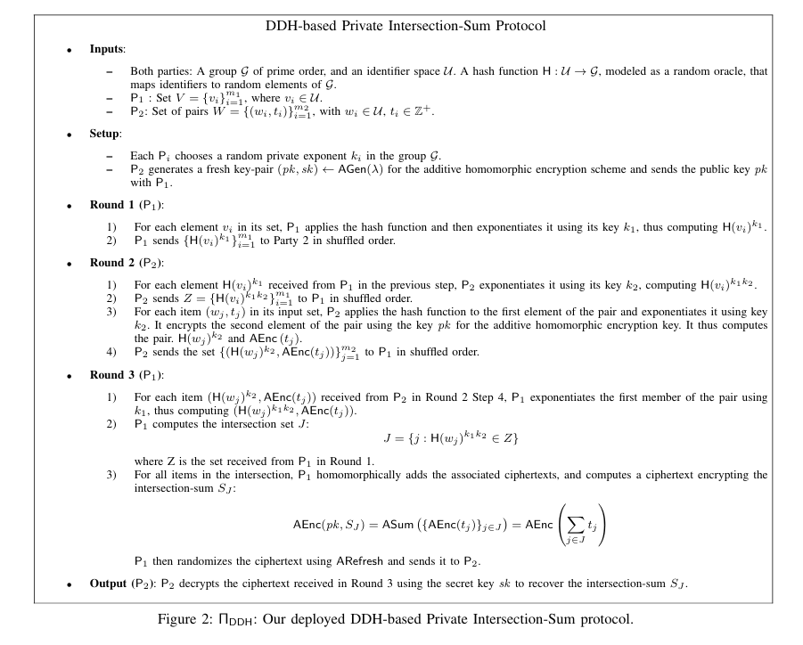
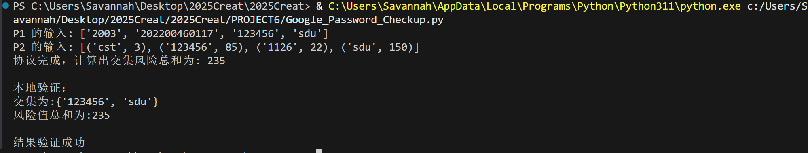

# Google Password Checkup验证
## 实验目的

本实验旨在实现并验证一个安全的双方计算协议。该协议用于计算两个私有集合交集元素的关联数值之和，同时保护各方数据的隐私性。具体来说，一方（P1）拥有一组标识符，另一方（$P_2$）拥有一组标识符及其对应的风险值。协议的目标是计算出 P1 集合中与 $P_2$集合中相交标识符的风险总值，而在此过程中，P1 不会泄露自己的标识符给 $P_2$，$P_2$也不会泄露其数据库中与 P1 不相交的任何信息。
本实验基于Paillier同态加密算法实现。

## 实验内容

协议通过一个三轮交互过程完成。
### 协议流程

#### 准备阶段

$P_2$生成 Paillier 公私钥对，并将公钥发送给$P_1$。

#### 第一轮 ($P_1 \rightarrow P_2$)：

- $P_1$ 对其集合 $V$ 中的每个标识符 $v$ 计算哈希值 $H(v)$。

- 使用其秘密随机数 $k_1$ 对哈希值进行盲化：$v_{k1}=pow(H(v), k_1, p)$。
- 将所有盲化后的值随机排序$V'$后发送给$P_2$。

#### 第二轮 ($P_2$-> $P_1$)：

- $P_2$接收到 $P_1$ 的数据后，使用其秘密随机数 k2 进行二次盲化，得到集合 $Z = \{pow(v_{k1}, k_2, p)\}$。
- $P_2$对自己的集合 W 中的每个标识符$w$计算 $w_{k2} = pow(H(w), k_2, p)$。
- $P_2$使用 Paillier 公钥加密与每个$w$关联的风险值$t$，得到 $encrypted_t$。
- $P_2$将$(w_{k2}, encrypted_t)$对和集合$Z$一起随机排序后发送给$P_1$。

#### 第三轮 ($P_1$-> $P_2$)：

- $P_1$接收到 $P_2$的数据。对于 $P_2$发来的每一个 h_w_k2，$P_1$用自己的密钥 k1 计算 pow(h_w_k2, k1, p)。
- $P_1$将计算结果与集合 Z 中的值进行比较。如果匹配，则说明该标识符是交集的一部分。
- $P_1$收集所有匹配项对应的加密风险值 encrypted_t。
- 利用 Paillier 的加法同态性，$P_1$将所有收集到的 encrypted_t 进行累加，得到一个加密的总和 encrypted_sum。
- $P_1$将 encrypted_sum 发送给 $P_2$。

#### 最终解密 ($P_2$)：

$P_2$收到加密的总和后，使用自己的 Paillier 私钥进行解密，得到最终的交集风险总值。
## 运行结果

可观察到本地验证结果与协议结果一致，验证正确。